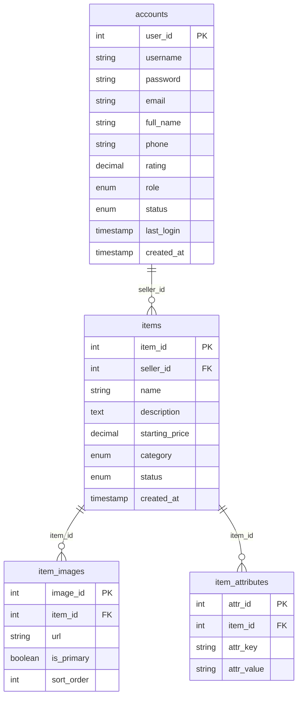
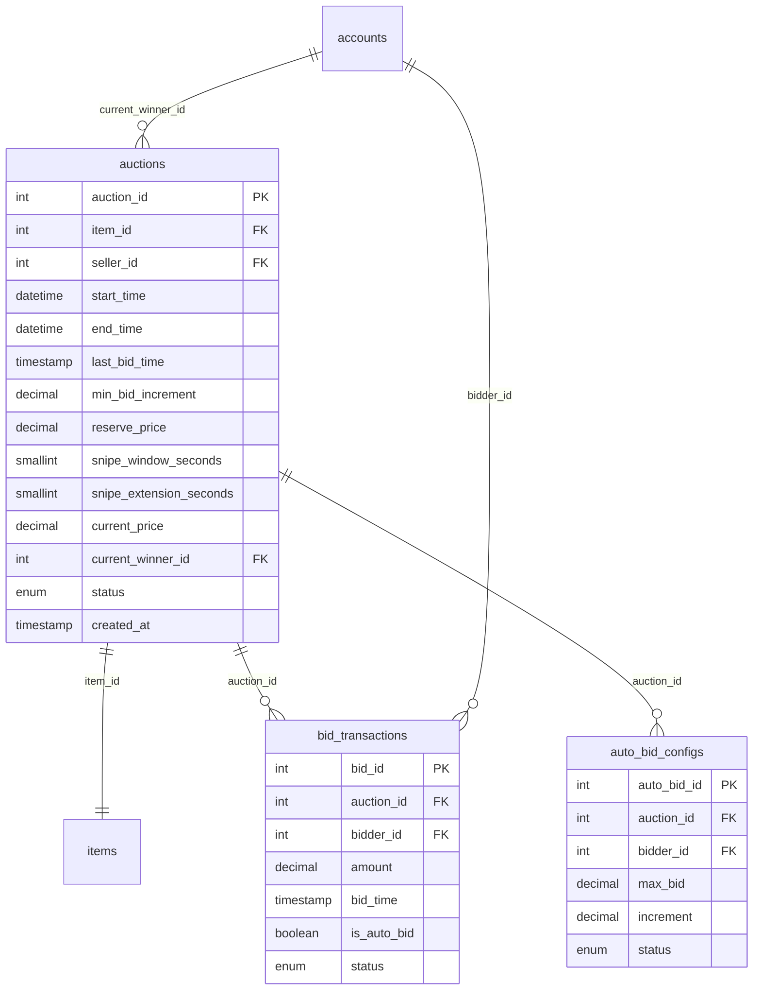
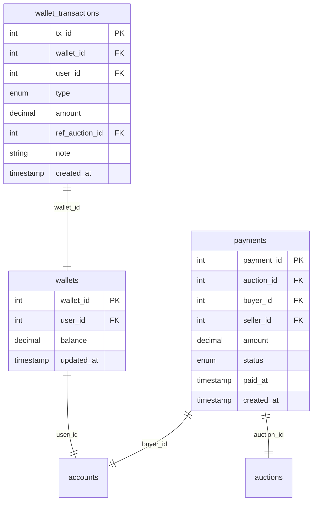
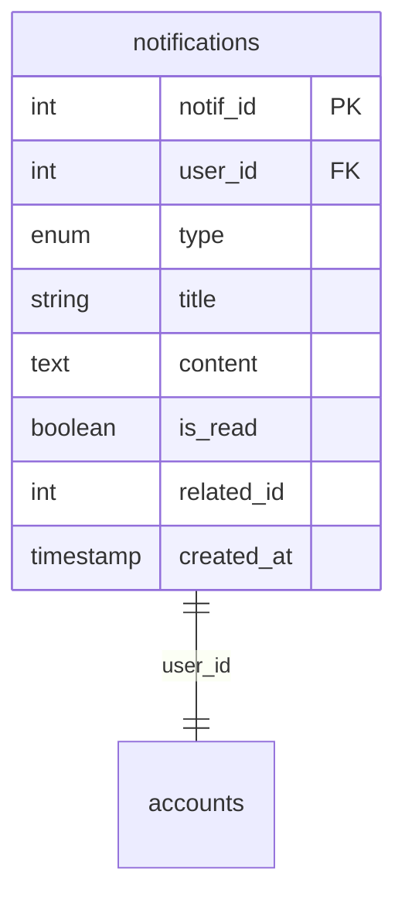

# BÁO CÁO PHÂN TÍCH CHI TIẾT SƠ ĐỒ CƠ SỞ DỮ LIỆU (DATABASE SCHEMA)
Tài liệu này cung cấp cái nhìn chi tiết và phân tích sâu về thiết kế cơ sở dữ liệu của hệ thống đấu giá trực tuyến (Online Auction System) dựa trên file định nghĩa [01_schema.sql](./database/01_schema.sql).
---
## 1. Thiết kế Định danh & Khóa chính (Primary Key Generation)
Hệ thống sử dụng cơ chế cấp phát giá trị tuần tự (Sequence-based auto-generation) cho các trường khóa chính thay vì sử dụng từ khóa `AUTO_INCREMENT` mặc định của MySQL:
```sql
user_id INT DEFAULT nextval(seq_accounts) PRIMARY KEY
```
### Đánh giá kỹ thuật:
- **Tương thích phân tán tốt**: Phù hợp khi triển khai trên **TiDB Cloud**. Hàm `nextval()` hoạt động độc lập giúp giảm tải cho việc đồng bộ auto-increment trên hệ thống cơ sở dữ liệu phân tán nhiều node.
- **Rõ ràng và kiểm soát tốt**: Dễ dàng lấy giá trị ID tiếp theo phục vụ việc chèn dữ liệu thủ công hoặc viết test case mà không phụ thuộc vào trạng thái ghi hiện thời của bảng.
---
## 2. Chi tiết các Phân hệ & Cấu trúc Bảng dữ liệu
Cơ sở dữ liệu được chia làm 4 phân hệ chính hoạt động thống nhất:
### 2.1. Phân hệ Tài khoản & Quản lý Vật phẩm (User & Inventory Subsystem)
Phân hệ này quản lý thông tin người dùng, phân quyền và trạng thái vật phẩm được đem ra đấu giá.

#### Bảng `accounts`
- **Vai trò**: Lưu trữ thông tin định danh và quyền hạn của người dùng.
- **Quyền hạn (`role`)**: Sử dụng kiểu dữ liệu `ENUM('USER', 'ADMIN')` giúp phân định rõ ranh giới quyền lực của tài khoản hệ thống.
- **Trạng thái (`status`)**: Gồm `ACTIVE`, `SUSPENDED`, `BANNED` cho phép Admin điều khiển quyền truy cập của người dùng mà không cần xóa dữ liệu gốc.
- **Khóa duy nhất**: `username` và `email` đều có chỉ mục `UNIQUE` tránh trùng lặp tài khoản.
#### Bảng `items`
- **Vai trò**: Lưu trữ danh mục các sản phẩm ký gửi đấu giá.
- **Vòng đời vật phẩm (`status`)**: Gồm `DRAFT`, `PENDING_REVIEW`, `AVAILABLE`, `IN_AUCTION`,`SOLD`, `REMOVED`.
- **Ràng buộc khóa ngoại**: `FOREIGN KEY (seller_id) REFERENCES accounts(user_id) ON DELETE RESTRICT`. Không cho phép xóa tài khoản người dùng nếu họ đang sở hữu vật phẩm trong danh mục hệ thống.
#### Bảng `item_images`
- **Vai trò**: Quản lý đa phương tiện (URLs hình ảnh liên kết Cloudinary).
- **Đặc điểm**: Cột `is_primary` và `sort_order` giúp UI Client kết xuất giao diện một cách đồng bộ.
- **Hành động xóa**: `ON DELETE CASCADE` - tự động xóa toàn bộ bản ghi ảnh khi vật phẩm tương ứng bị xóa.
#### Bảng `item_attributes` (Thiết kế EAV)
- **Vai trò**: Lưu các thông số kỹ thuật mở rộng của vật phẩm.
- **Đánh giá**: Sử dụng mô hình **Entity-Attribute-Value (EAV)** thông qua 2 cột `attr_key` và `attr_value`. Cho phép mở rộng động các thông tin tùy thuộc vào danh mục (Ví dụ: Danh mục *Xe cộ* cần các thuộc tính *Hãng xe, Số km đã đi*, còn danh mục *Nghệ thuật* cần *Tác giả, Chất liệu*) mà không cần thiết kế lại cấu trúc bảng.
---
### 2.2. Phân hệ Phòng Đấu giá & Lịch sử Đặt giá (Core Auction Subsystem)
Quản lý thông tin thời gian thực của các phòng đấu giá, lịch sử đặt giá và các thiết lập tự động hóa.

#### Bảng `auctions`
- **Vai trò**: Lưu cấu hình phiên đấu giá và trạng thái giá trị thời gian thực.
- **Khóa độc quyền**: `item_id INT NOT NULL UNIQUE` đảm bảo một vật phẩm chỉ có tối đa một phiên đấu giá duy nhất.
- **Cấu hình chống Sniping**: Trường `snipe_window_seconds` và `snipe_extension_seconds` cấu hình tham số thời gian để cộng dồn vào `end_time` khi có bid đặt sát giờ đóng phiên.
- **Trạng thái đấu giá (`status`)**: Gồm `OPEN` (đợi giờ chạy), `RUNNING` (đang chạy), `FINISHED` (kết thúc phiên), `PAID` (đã thanh toán), `CANCELED` (bị hủy bỏ bởi Admin/Hệ thống).
#### Bảng `bid_transactions`
- **Vai trò**: Ghi lại lịch sử đặt giá của các bidder.
- **Đặc điểm**: Lưu trữ cờ `is_auto_bid` để hệ thống biết được giao dịch này được kích hoạt tự động hay đặt bằng tay.
- **Trạng thái bid (`status`)**: Gồm `WINNING`, `OUTBID`, `WON`, `LOST`.
#### Bảng `auto_bid_configs`
- **Vai trò**: Cấu hình quy tắc đấu giá tự động (Auto-Bid) cho người dùng.
- **Độ an toàn**: Ràng buộc `CONSTRAINT unique_auction_bidder UNIQUE (auction_id, bidder_id)` đảm bảo mỗi người dùng chỉ cấu hình duy nhất một quy tắc nâng giá tự động trong cùng một phòng đấu giá.
---
### 2.3. Phân hệ Ví điện tử & Thanh toán hóa đơn (Finance & Payment Subsystem)
Quản lý tài chính, tạm đóng băng dòng tiền đấu giá và quyết toán hóa đơn khi hoàn tất giao dịch.

#### Bảng `wallets`
- **Vai trò**: Lưu trữ số dư khả dụng hiện tại của người dùng.
- **Kiểu dữ liệu**: `decimal(15,2)` đảm bảo độ chính xác tuyệt đối, tránh lỗi làm tròn dấu phẩy động của kiểu float/double khi tính toán tiền tệ.
#### Bảng `wallet_transactions`
- **Vai trò**: Lưu vết biến động số dư.
- **Phân loại giao dịch (`type`)**: Gồm `DEPOSIT` (nạp tiền), `WITHDRAW` (rút tiền), `HOLD` (tạm giữ/đóng băng tiền đấu giá nhằm bảo chứng số dư tài khoản khi đặt giá), `RELEASE` (giải phóng tiền cọc khi bị vượt giá), `PAYMENT` (thực thu tiền), `REFUND` (hoàn trả lại tiền cho người mua nếu phiên đấu giá bị Admin hủy).
- **Ràng buộc liên kết**: Cột `ref_auction_id` liên kết trực tiếp tới phòng đấu giá phát sinh giao dịch tài chính này.
#### Bảng `payments`
- **Vai trò**: Hóa đơn mua bán chung cuộc sau khi phiên đấu giá kết thúc thành công (`FINISHED`).
- **Trạng thái (`status`)**: Gồm `PENDING` (chờ người thắng bấm xác nhận thanh toán), `COMPLETED` (đã thanh toán thành công), `FAILED` (lỗi thanh toán), `REFUNDED` (đã hoàn tiền).
---
### 2.4. Phân hệ Thông báo (Notification Subsystem)
Quản lý và đồng bộ thông báo thời gian thực hoặc offline cho người dùng.

#### Bảng `notifications`
- **Loại thông báo (`type`)**: Gồm 12 loại sự kiện nghiệp vụ chi tiết (`BID_PLACED`, `OUTBID`, `AUCTION_WON`, `PAYMENT_DUE`, `ITEM_APPROVED`,`AUCTION_LOST`,`PAYMENT_RECEIVED`,`ITEM_REJECTED`,`AUCTION_STARTED`,`AUCTION_ENDED`,`TIME_EXTENDED`,`SYSTEM`).
- **Xử lý cascade**: Cấu hình `FOREIGN KEY (user_id) REFERENCES accounts(user_id) ON DELETE CASCADE`. Khi xóa tài khoản người dùng, toàn bộ thông báo liên quan sẽ được tự động xóa bỏ để tránh lãng phí dung lượng ổ cứng.
---
## 3. Tổng kết Đánh giá Kỹ thuật về Thiết kế Schema
1. **Độ tin cậy tài chính cao**: Sử dụng kiểu dữ liệu `DECIMAL` cho tất cả các cột liên quan đến tiền tệ (`starting_price`, `min_bid_increment`, `reserve_price`, `current_price`, `amount`, `balance`). Điều này ngăn chặn hoàn toàn sai số dấu thập phân trong các phép toán cộng trừ số dư ví.
2. **Cơ chế kiểm soát dòng tiền an toàn (Escrow Mechanism)**: Việc thiết kế các trạng thái `HOLD` và `RELEASE` trong `wallet_transactions` chứng tỏ hệ thống có cơ chế bảo chứng cọc. Người dùng chỉ có thể đặt giá khi số dư khả dụng trong ví lớn hơn hoặc bằng mức đặt cược, tiền sẽ bị đóng băng tạm thời cho đến khi có người trả giá cao hơn.
3. **Mối quan hệ chặt chẽ và nhất quán**:
    - Sử dụng `ON DELETE RESTRICT` cho các khóa ngoại cốt lõi như `seller_id`, `buyer_id` để bảo vệ dữ liệu lịch sử giao dịch không bị mất mát khi tài khoản bị yêu cầu xóa.
    - Sử dụng `ON DELETE CASCADE` cho các thực thể phụ thuộc hoàn toàn như hình ảnh (`item_images`) và thuộc tính vật phẩm (`item_attributes`) giúp bảo trì cơ sở dữ liệu sạch sẽ, không có bản ghi mồ côi.
    - Sử dụng `ON DELETE SET NULL` cho các trường liên kết động như người thắng cuộc hiện tại như (`current_winner_id`) và mã phiên đấu giá tham chiếu (`ref_auction_id`) giúp bảo toàn dấu vết lịch sử dòng tiền, tránh lỗi sập dây chuyền khi thực thể gốc bị gỡ bỏ.