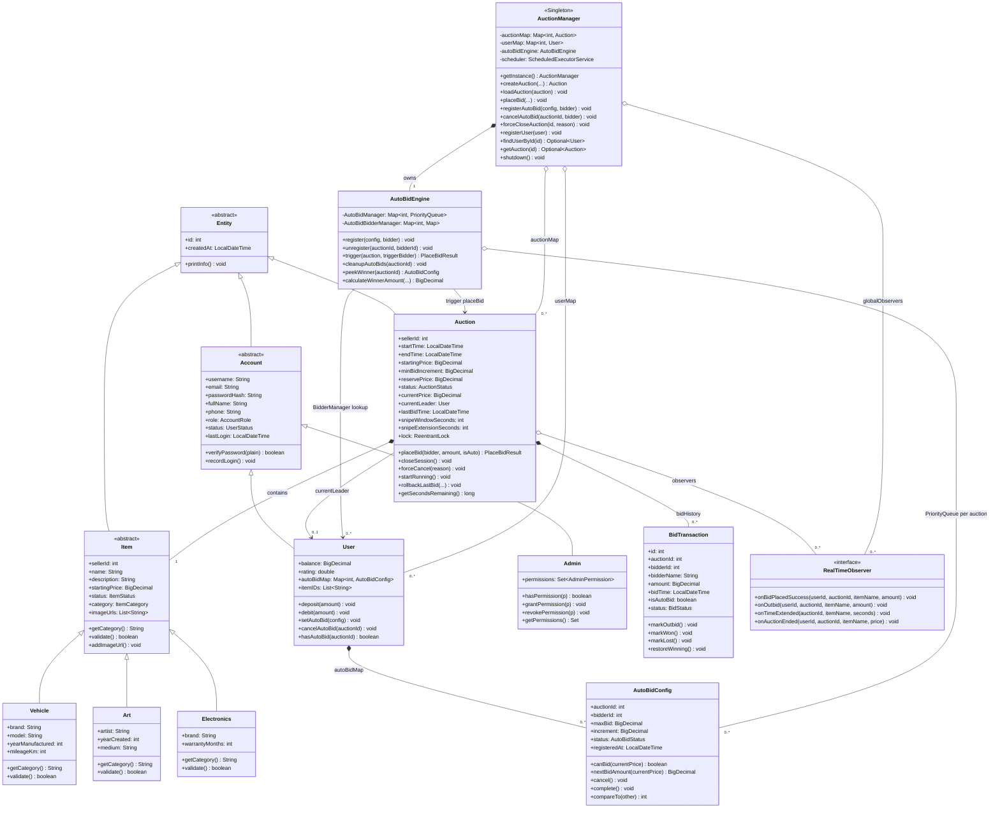

# Báo cáo Sơ đồ Entity — Hệ thống Đấu Giá Trực Tuyến

## 1. Cây Kế Thừa Chính

## 2. Quan Hệ Chính Giữa Các Lớp

| Từ lớp | Tới lớp | Loại | Ghi chú |
|---|---|---|---|
| `Auction` | `Item` | Composition 1:1 | Phiên gắn chặt với 1 sản phẩm |
| `Auction` | `BidTransaction` | Composition 1:N | Lịch sử bid (`bidHistory`) |
| `Auction` | `User` | Association 0..1 | `currentLeader` — người dẫn đầu |
| `Auction` | `RealTimeObserver` | Aggregation 1:N | Danh sách observer realtime |
| `User` | `AutoBidConfig` | Composition 1:N | `autoBidMap<auctionId, config>` |
| `AuctionManager` | `Auction` | Aggregation 1:N | Registry toàn bộ phiên trong RAM |
| `AuctionManager` | `User` | Aggregation 1:N | Registry toàn bộ user trong RAM |
| `AuctionManager` | `AutoBidEngine` | Composition 1:1 | Engine nội tại của Manager |
| `AutoBidEngine` | `AutoBidConfig` | Aggregation 1:N | `PriorityQueue` per auction |

---

## 3. Vai Trò Các Lớp

### Lớp nền tảng

`Entity` là lớp gốc trừu tượng — cung cấp `id` và `createdAt` cho toàn bộ hệ thống, định nghĩa `equals/hashCode` theo `id`.

`Account` (abstract) kế thừa `Entity`, chứa logic xác thực mật khẩu BCrypt. Hai subclass `User` (bidder/seller, có ví tiền và auto-bid map) và `Admin` (có tập quyền động) kế thừa từ đây.

`Item` (abstract) đại diện sản phẩm đấu giá. Ba subclass `Electronics`, `Art`, `Vehicle` override `getCategory()` và `validate()` với rule riêng. `ItemFactory` tạo đúng subclass từ category string (Factory Pattern).

---

### Lớp trung tâm

**`Auction`** là lớp lõi của hệ thống — quản lý toàn bộ state một phiên đấu giá trong RAM. Chứa `Item`, danh sách `BidTransaction`, con trỏ `currentLeader`, và `ReentrantLock(fair=true)` bảo vệ critical section. Ba chức năng cốt lõi:
- `placeBid()` — validate + cập nhật state + anti-snipe, thread-safe qua lock.
- `closeSession()` — xác định winner/canceled dựa trên reserve price và bid history.
- `notifyBidCommitted()` — phát sự kiện tới tất cả `RealTimeObserver` sau khi DB commit.

**`AuctionManager`** (Singleton) là điểm truy cập duy nhất vào tầng domain. Duy trì `auctionMap` và `userMap` trong RAM, sở hữu `AutoBidEngine` và `ScheduledExecutorService` để tự động mở/đóng phiên theo thời gian. Không tầng nào khác được tham chiếu trực tiếp tới `Auction` object mà không qua Manager.

**`AutoBidEngine`** xử lý toàn bộ logic đặt giá tự động. Mỗi auction có một `PriorityQueue<AutoBidConfig>` riêng — config `maxBid` cao hơn được ưu tiên, bằng nhau thì ai đăng ký sớm hơn thắng (FIFO tie-breaking). Trigger được gọi sau mỗi bid thủ công, khi auction mở, hoặc khi có config mới đăng ký / hủy,.

**`RealTimeObserver`** (interface) tách biệt domain logic khỏi network layer. `Auction` chỉ biết gọi `onBidPlacedSuccess()`, `onOutbid()`, `onTimeExtended()` — không quan tâm phía sau là socket hay bất kỳ cơ chế gì khác (Observer Pattern).

---

### Lớp dữ liệu

`BidTransaction` ghi lại một lần đặt giá — hầu hết các trường là `final`, chỉ `status` thay đổi theo vòng đời `WINNING → OUTBID → WON/LOST`.

`AutoBidConfig` lưu cấu hình auto-bid của một bidder trong một phiên, implements `Comparable` để sắp xếp trong PriorityQueue của Engine.

---

## 4. Design Patterns Áp Dụng

| Pattern | Nơi áp dụng |
|---|---|
| **Singleton** | `AuctionManager` — một registry duy nhất trong toàn bộ server |
| **Factory** | `ItemFactory` — tạo đúng subclass `Item` từ category string |
| **Observer** | `Auction → RealTimeObserver` — notify realtime sau khi DB commit |

---
