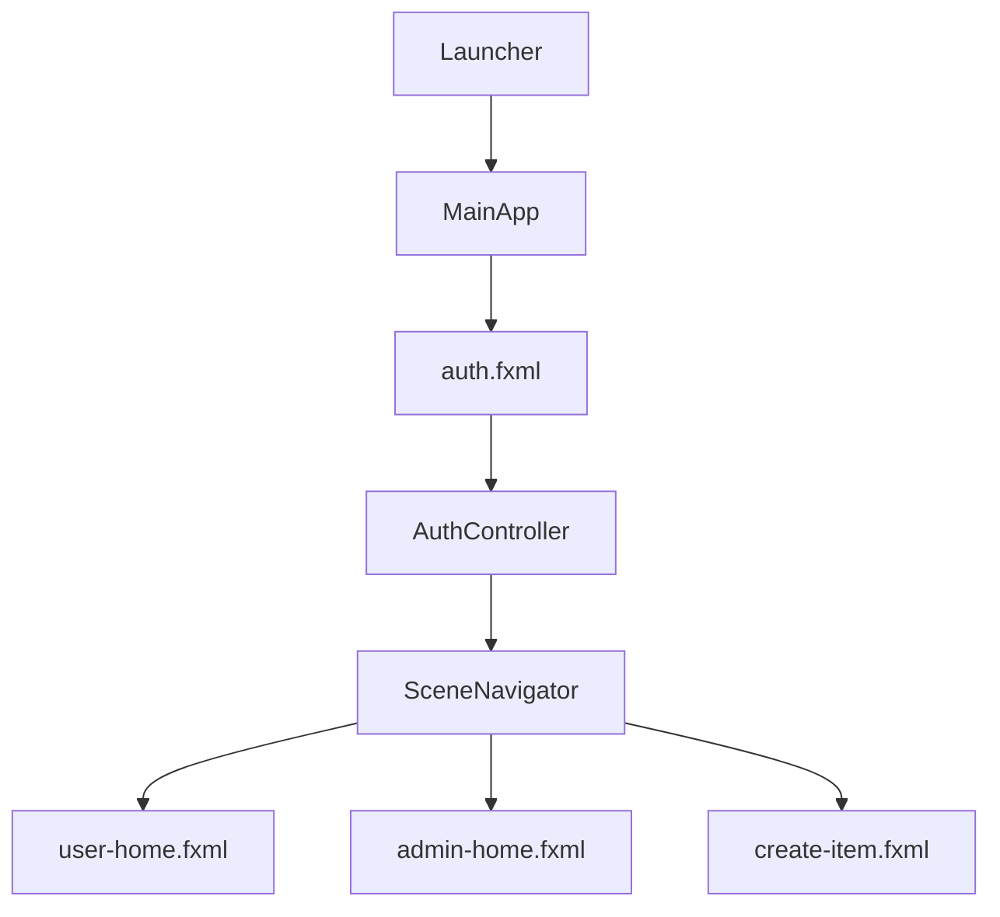
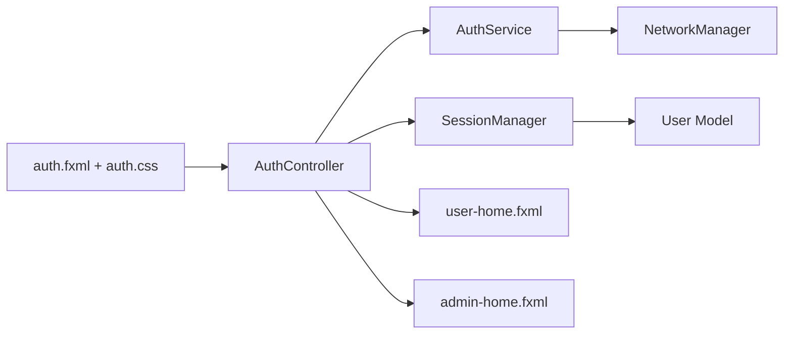
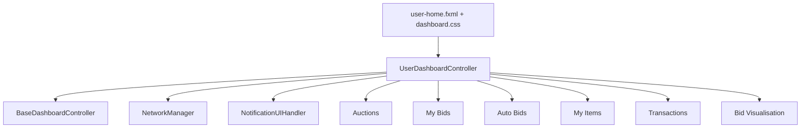
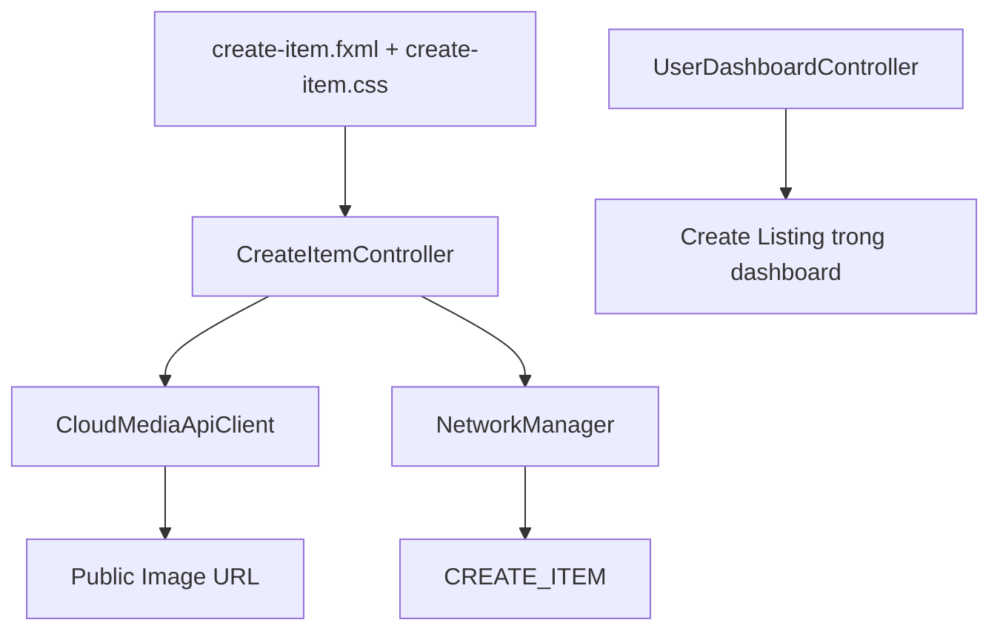
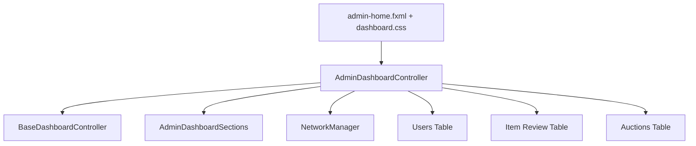

# BÁO CÁO PHÂN TÍCH CHI TIẾT GIAO DIỆN NGƯỜI DÙNG (UI CLIENT)

Tài liệu này cung cấp cái nhìn chi tiết và phân tích sâu về thiết kế giao diện JavaFX của hệ thống đấu giá trực tuyến (Online Auction System) dựa trên thư mục [`client`](./client) trong project hiện tại.

---

## 1. Thiết kế Điều hướng & Khởi tạo giao diện (Scene Navigation)

Hệ thống sử dụng JavaFX làm tầng giao diện chính, tách phần khởi tạo ứng dụng, điều hướng màn hình và xử lý controller thành các lớp riêng:

### Đánh giá kỹ thuật:
- **Điều hướng tập trung**: `SceneNavigator` chịu trách nhiệm tạo scene ban đầu, giữ kích thước cửa sổ và chuyển scene mà không làm mất trạng thái maximize/fullscreen của người dùng.
- **Tách màn hình theo FXML**: Các màn hình chính như `auth.fxml`, `user-home.fxml`, `admin-home.fxml`, `create-item.fxml` được khai báo riêng giúp phần layout không bị trộn trực tiếp vào logic nghiệp vụ.
- **Giữ trải nghiệm nhất quán**: Kích thước mặc định và kích thước tối thiểu được gom tại `SceneNavigator`, hạn chế lỗi giao diện vỡ layout khi chuyển qua lại giữa các màn hình.

---

## 2. Chi tiết các Phân hệ & Cấu trúc UI Client

Giao diện client được chia làm 4 phân hệ chính hoạt động thống nhất:

### 2.1. Phân hệ Đăng nhập, Đăng ký & Phiên người dùng (Authentication & Session UI)

Phân hệ này xử lý màn hình đăng nhập/đăng ký, xác thực tài khoản, điều hướng theo role và lưu trạng thái phiên đăng nhập hiện tại.

#### `AuthController`
- **Vai trò**: Điều khiển màn hình authentication, nhận dữ liệu form, hiển thị lỗi/nhắc nhở và chuyển màn hình sau khi đăng nhập thành công.
- **Luồng role**: Sau khi server xác thực thành công, UI phân biệt `USER` và `ADMIN` để điều hướng tới dashboard tương ứng.
- **Xử lý trạng thái tài khoản**: Có cơ chế phản hồi lỗi đăng nhập, bao gồm trường hợp tài khoản không hợp lệ hoặc bị khóa/bị ban tùy theo phản hồi từ server.

#### `AuthService`
- **Vai trò**: Đóng gói request đăng nhập để controller không phải trực tiếp tự dựng command xác thực.
- **Đặc điểm**: Gửi command `LOGIN <identity> <password>` qua `NetworkManager`, giữ logic gửi dữ liệu mạng nằm ngoài controller giao diện.

#### `SessionManager`
- **Vai trò**: Lưu thông tin user hiện tại sau khi đăng nhập.
- **Đánh giá**: Giúp các màn hình dashboard, ví, thông báo và tạo listing có thể đọc chung thông tin phiên mà không cần truyền thủ công qua nhiều constructor.

---

### 2.2. Phân hệ Dashboard người dùng & Luồng đấu giá (User Dashboard & Auction Flow)

Phân hệ này là trung tâm trải nghiệm của người dùng thường, bao gồm danh sách auction, chi tiết auction, đặt giá, auto-bid, ví, giao dịch, thông báo và quản lý item của seller.

#### `UserDashboardController`
- **Vai trò**: Điều phối toàn bộ dashboard người dùng, render danh sách auction, xử lý chi tiết phiên đấu giá, đặt giá thường, auto-bid, ví, giao dịch và seller workspace.
- **Command kết nối backend**: UI gọi các luồng chính như `USER_LIST_AUCTIONS`, `JOIN_AUCTION`, `LEAVE_AUCTION`, `BID`, `AUTOBID_REGISTER`, `AUTOBID_CANCEL`, `USER_LIST_BIDS`, `USER_LIST_AUTOBIDS`, `USER_LIST_TRANSACTIONS`, `SELLER_AUCTION_BIDS`, `GET_AUCTION_VISUALISATION`.
- **Trải nghiệm thời gian thực**: Controller đăng ký message handler với `NetworkManager`, nhận phản hồi từ server rồi cập nhật lại card auction, bảng dữ liệu, biểu đồ và thông báo.
- **Bảo vệ flow thao tác**: Các hành động như bid, auto-bid, payment hoặc reload dữ liệu đều có kiểm tra trạng thái kết nối và thông báo lỗi phù hợp khi server không sẵn sàng.

#### `UserDashboardSections`
- **Vai trò**: Tách phần nội dung tĩnh của từng section như Auctions, My Bids, Auto Bids, My Items và Transactions ra khỏi controller chính.
- **Đánh giá**: Giúp dashboard dễ bảo trì hơn vì title, subtitle, mô tả và activity line không còn nằm rải rác trong controller render giao diện.

#### Các lớp dữ liệu hiển thị
- **`AuctionCardData`**: Gom dữ liệu cần render card auction như tên item, trạng thái, giá hiện tại, thời gian còn lại và thông tin seller/winner.
- **`MyBidData`**: Đại diện cho dữ liệu bảng My Bids, giúp UI so sánh giá hiện tại, bid của user và trạng thái thắng/thua.
- **`AutoBidData`**: Đại diện cho cấu hình auto-bid đang hoạt động hoặc đã hoàn tất/hủy.
- **`SellerItemData`**: Đại diện cho item của seller trong My Items, gồm trạng thái review, trạng thái auction và dữ liệu phục vụ action theo từng item.
- **`TransactionData`**: Gom dữ liệu ví, payment và refund để màn Transactions không phải xử lý trực tiếp dữ liệu thô từ server.
- **`BidHistoryData`**: Phục vụ render lịch sử giá và biểu đồ visualisation.

---

### 2.3. Phân hệ Tạo Listing & Upload hình ảnh (Create Listing UI)

Phân hệ này xử lý việc người dùng tạo item mới, nhập thuộc tính theo category và upload hình ảnh trước khi gửi item lên server để chờ admin review.

#### `CreateItemController`
- **Vai trò**: Điều khiển form tạo item riêng, validate dữ liệu nhập, chọn ảnh, upload ảnh và gửi command tạo item.
- **Validate phía UI**: Kiểm tra category, title, starting price, artist/year đối với item ART và giới hạn số lượng ảnh trước khi gửi server.
- **Tối ưu trải nghiệm**: Có trạng thái đang upload/đang submit, thông báo thành công/thất bại và nút quay lại user home.

#### `CloudMediaApiClient`
- **Vai trò**: Upload hình ảnh lên dịch vụ media, nhận URL public để gửi kèm trong payload tạo item.
- **Đánh giá**: Tách việc upload media khỏi controller, giúp logic tạo listing rõ hơn và tránh controller phải xử lý chi tiết HTTP/media.

#### `CreateItemUpload`
- **Vai trò**: Lưu thông tin ảnh người dùng chọn trong lúc tạo item.
- **Đặc điểm**: Giúp UI quản lý danh sách ảnh tạm thời trước khi quyết định upload hoặc submit item.

---

### 2.4. Phân hệ Admin Dashboard & Quản trị hệ thống (Admin Console UI)

Phân hệ này cung cấp màn hình quản trị tập trung cho admin, tập trung vào những tác vụ đã có logic backend: duyệt item, tạo auction, theo dõi auction, ban/restore user và force close phiên phù hợp.

#### `AdminDashboardController`
- **Vai trò**: Điều phối toàn bộ admin-home, render bảng Users, Item Review, Auctions và gửi action quản trị tới server.
- **Command kết nối backend**: UI sử dụng các command `ADMIN_LIST_USERS`, `ADMIN_LIST_ITEMS`, `ADMIN_LIST_AUCTIONS`, `ADMIN_APPROVE_ITEM`, `ADMIN_REJECT_ITEM`, `ADMIN_CREATE_AUCTION`, `ADMIN_BAN_USER`, `ADMIN_UNBAN_USER`, `ADMIN_FORCE_CLOSE`.
- **Thiết kế an toàn**: Admin UI không expose chỉnh sửa trực tiếp ví, payment hoặc bid thủ công; các action chỉ bám vào command backend đã có.
- **Cơ chế refresh**: Khi server trả success hoặc broadcast dữ liệu dirty, bảng tương ứng được reload để tránh hiển thị trạng thái cũ.

#### `AdminDashboardSections`
- **Vai trò**: Gom nội dung mô tả các section Dashboard, Item Review, Auctions và Users.
- **Đánh giá**: Phần copy tĩnh của admin không bị trộn với logic xử lý action, giúp controller tập trung hơn vào render và message handling.

#### `AdminRow` và `UserRow`
- **`AdminRow`**: Chuẩn hóa dữ liệu hiển thị cho bảng item/auction ở admin-home.
- **`UserRow`**: Chuẩn hóa dữ liệu người dùng, trạng thái tài khoản và action ban/restore.
- **Đánh giá**: Các row model này giúp bảng admin render theo dữ liệu đã parse thay vì dùng chuỗi server thô trực tiếp ở từng ô UI.

---

## 3. Phân hệ dùng chung & Hạ tầng UI (Shared UI Infrastructure)

Ngoài các màn hình nghiệp vụ, client có các thành phần dùng chung để giảm trùng lặp và đảm bảo toàn bộ UI phản hồi thống nhất.

### 3.1. `BaseDashboardController`
- **Vai trò**: Lớp nền cho cả User Dashboard và Admin Dashboard.
- **Chức năng chính**: Quản lý navigation sidebar, header, notification center, logout, đổi section, render phần nội dung tĩnh và xử lý thông báo chung.
- **Đánh giá**: Việc dùng base controller giúp hai dashboard có layout và hành vi chung, hạn chế duplicate code ở phần sidebar/notification/navigation.

### 3.2. `NotificationUIHandler`
- **Vai trò**: Chuẩn hóa toast notification, popup thông báo và mapping loại thông báo từ server sang kiểu hiển thị UI.
- **Đặc điểm**: Các loại notification như `OUTBID`, `PAYMENT_DUE`, `AUCTION_WON`, `ITEM_APPROVED`, `PAYMENT_RECEIVED`, `SYSTEM` được phân loại để hiển thị warning/success/error phù hợp.

### 3.3. `NetworkManager`
- **Vai trò**: Quản lý socket TCP dùng chung cho toàn bộ client.
- **Cơ chế kết nối**:
    - Dò host qua `ServerFinder`.
    - Kết nối tới server qua port `6666`.
    - Tự reconnect với delay tăng dần.
    - Có heartbeat định kỳ để giữ kết nối.
    - Duy trì message handler theo màn hình.
- **An toàn thao tác**: Các command không được replay như `BID`, `CREATE_ITEM`, `CONFIRM_PAYMENT`, `REFUND_PAYMENT`, `DEPOSIT_WALLET`, `ADMIN_CREATE_AUCTION`, `ADMIN_BAN_USER` được đánh dấu riêng để tránh gửi lại hành động nhạy cảm sau khi mất mạng.

### 3.4. `ServerFinder`
- **Vai trò**: Tìm danh sách host ứng viên cho server.
- **Đánh giá**: Phù hợp khi chạy project trên nhiều máy vì UI có thể ưu tiên host cấu hình, biến môi trường, UDP discovery hoặc localhost tùy logic triển khai hiện tại.

---

## 4. Tổng kết Đánh giá Kỹ thuật về Thiết kế UI Client

1. **UI đã bám tương đối đầy đủ flow backend chính**: Các luồng người dùng quan trọng như đăng nhập, xem auction, join/leave auction, bid, auto-bid, create item, wallet transaction, confirm payment, refund và notification đều có entry point ở UI.

2. **Admin-home được thiết kế theo hướng tối giản và an toàn**:
    - Chỉ giữ các chức năng có command backend rõ ràng: duyệt item, tạo auction, quản lý user, theo dõi/cancel auction.
    - Không cho admin sửa trực tiếp tiền, payment, bid hoặc dữ liệu nhạy cảm ngoài luồng nghiệp vụ.
    - Các bảng admin được dùng như bảng quản trị/trạng thái thay vì biến thành nhiều màn hình chỉnh sửa phức tạp.

3. **Tầng mạng có khả năng chịu lỗi tốt hơn client cơ bản**:
    - `NetworkManager` dùng singleton socket, reconnect, heartbeat và queue command.
    - Các command nhạy cảm được đánh dấu không replay để hạn chế lỗi gửi lặp thao tác tài chính hoặc bid sau khi mất kết nối.
    - UI có thông báo lỗi khi server/database chưa sẵn sàng thay vì render dữ liệu giả.

4. **Giao diện đã có hướng tách module nhưng vẫn còn điểm nặng**:
    - Các lớp phụ như `UserDashboardSections`, `AdminDashboardSections`, `TransactionFailureMessages`, `UserTransactionFlow`, các row/data model đã giúp giảm tải một phần controller.
    - Tuy nhiên `UserDashboardController` và `AdminDashboardController` vẫn rất dài, vừa render UI, vừa parse message, vừa xử lý action.

5. **Thiết kế giao diện ưu tiên đồng bộ trạng thái thực từ server**:
    - Nhiều section không render dữ liệu giả, chỉ hiển thị sau khi server trả danh sách thật.
    - Các bảng My Bids, Auto Bids, My Items, Transactions và Admin đều phản ánh trạng thái backend thay vì tự suy diễn quá nhiều ở UI.
    - Điều này giúp giảm nguy cơ lệch giữa client và database, đặc biệt với các flow tài chính và đấu giá thời gian thực.

6. **CSS/FXML đã được gom theo màn hình nhưng dashboard style đang rất lớn**:
    - `auth.css`, `create-item.css`, `dashboard.css` giúp tách style khỏi Java code.
    - `dashboard.css` đang là file style lớn nhất, dùng chung cho nhiều màn hình.
